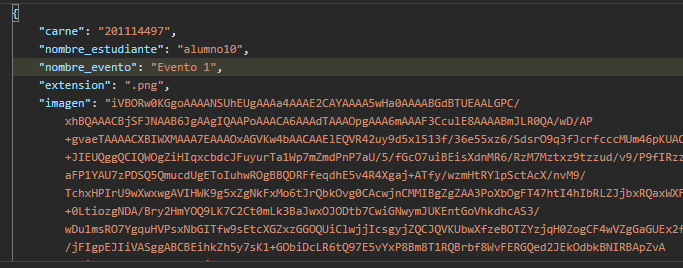
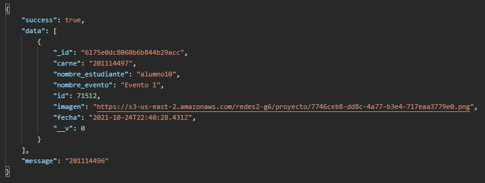
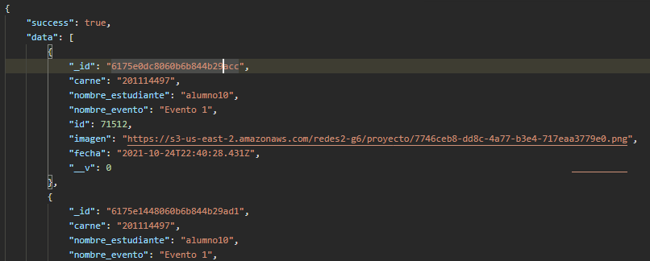
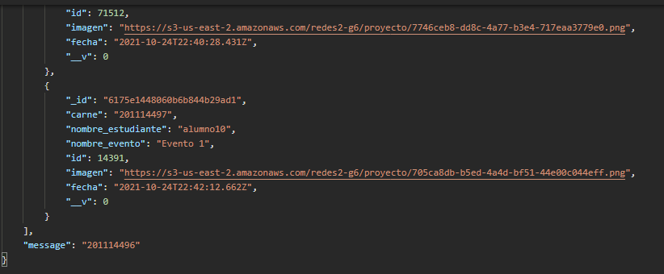

| Tipo  | Endpoin                                     | Descripción                   |
|-------|---------------------------------------------|-------------------------------|
| Post  |<http://ip:3002/>asistencia             | Crea una nueva asistencia     |
| Get   |<http://ip:3002/>asistencia/evento/:id  | Filtra por evento (id)        |
| Get   |<http://ip:3002/>asistencia/carne/:id   | Filtra por carnet (id)        |
| Get   |<http://ip:3002/>asistencia             | Obtiene todas las asistencias |

### Post data send

### Get evento

### Get Carne

### Get ALL

